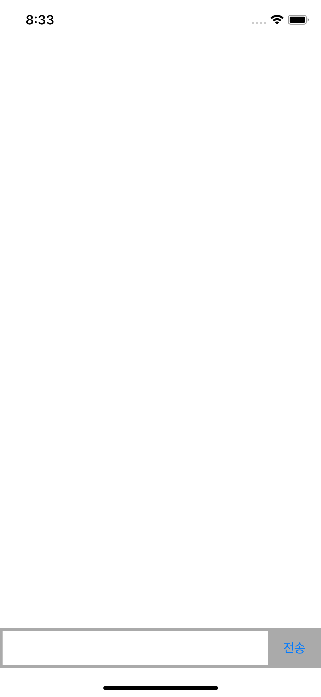
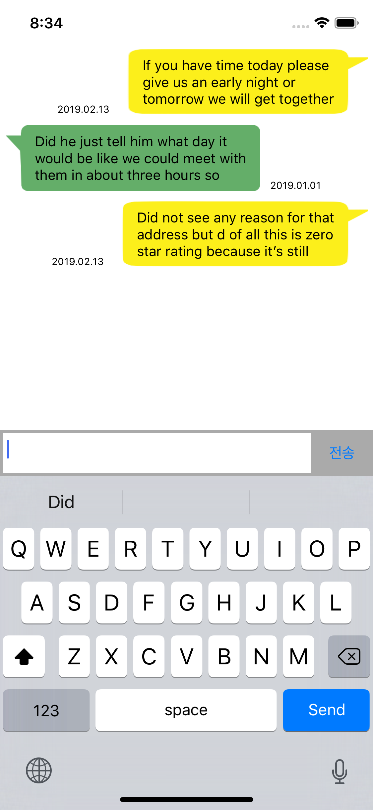

채팅 화면 구성
* UIImageView - image stretching
* 
* 


Screen Shot
---
iPhoneXS

 


```
override func viewDidLoad() {
    super.viewDidLoad()
    
    // selector
    emailTextField.addTarget(self, action: #selector(editStatusChanged), for: UIControl.Event.editingChanged)
    passwordTextField.addTarget(self, action: #selector(editStatusChanged), for: UIControl.Event.editingChanged)
    
    // view의 높이에 대한 constraint
    emailErrorConstraint = emailErrorLabel.heightAnchor.constraint(equalToConstant: 0)
    passwordErrorConstraint = passwordErrorLabel.heightAnchor.constraint(equalToConstant: 0)
    
    // 첫 화면에서는 표시되지 않도록
    emailErrorConstraint?.isActive = true
    passwordErrorConstraint?.isActive = true
}
    

```
