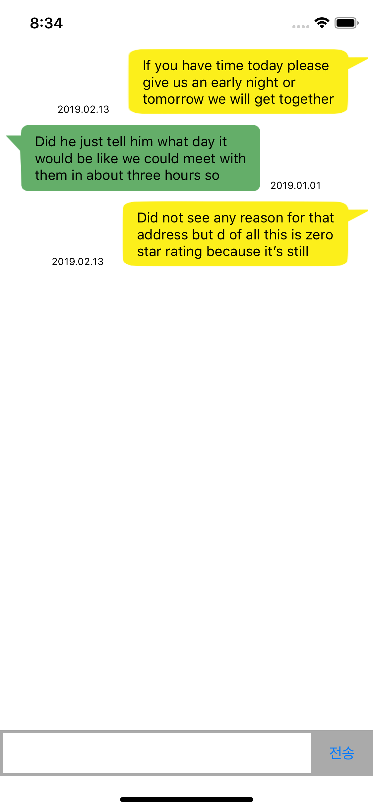
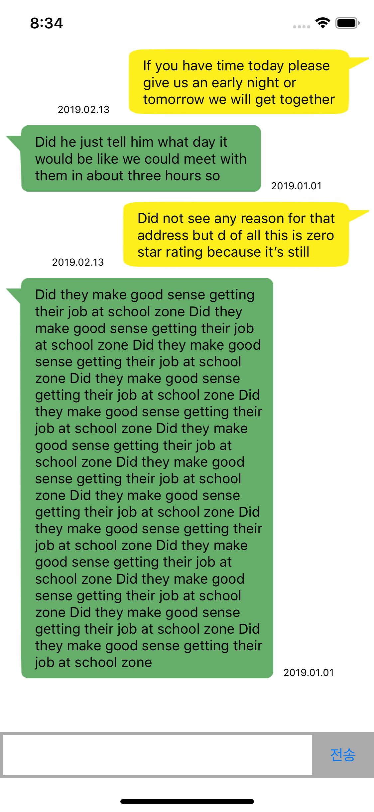

채팅 화면 구성
* UIImageView - image stretching
* NotificationCenter - addObserver(키보드의 움직임을 확인하기 위해 사용)
* 별도의 xib 파일을 이용하여 각각의 cell 구현
* TextViewDelegate를 이용하여 사이즈 handling(메시지 입력 폼 최대/최소 크기 지정)


Screen Shot
---
iPhoneXS

   


```


// nib 파일을 cell로 사용할 수 있도록 등록
chatTableView.register(UINib(nibName: "MyMessageCell", bundle: nil), forCellReuseIdentifier: "MyMessageCell")
chatTableView.register(UINib(nibName: "YourMessageCell", bundle: nil), forCellReuseIdentifier: "YourMessageCell")


// 키보드 관련 옵저버 - 키보드 상태를 알려주는 것
// 키보드 올라갈 때
NotificationCenter.default.addObserver(self, selector: #selector(keyboardWillShow), name: UIResponder.keyboardWillShowNotification, object: nil)

// 키보드 내려갈 때
NotificationCenter.default.addObserver(self, selector: #selector(keyboardWillHide), name: UIResponder.keyboardWillHideNotification, object: nil)

// TextView 사이즈 handling
@objc func keyboardWillShow(notification: Notification) {
    
    // notificaiton 정보 배열
    let userInfo = notification.userInfo!
    
    // UIResponder의 키보드 프레임 정보
    let keyboardFrame = userInfo[UIResponder.keyboardFrameEndUserInfoKey] as! CGRect
    
    // 키보드 애니메이션 시간정보
    let keyboardAnimationDuration = userInfo[UIResponder.keyboardAnimationDurationUserInfoKey] as! TimeInterval
    
    UIView.animate(withDuration: keyboardAnimationDuration) {
        self.textViewBottomConstraint.constant = keyboardFrame.size.height - self.view.safeAreaInsets.bottom
        self.view.layoutIfNeeded()
    }
    
    
}
@objc func keyboardWillHide(notification: Notification) {
    let userInfo = notification.userInfo!
    let keyboardAnimationDuration = userInfo[UIResponder.keyboardAnimationDurationUserInfoKey] as! TimeInterval
    UIView.animate(withDuration: keyboardAnimationDuration) {
        
        self.textViewBottomConstraint.constant = 0
        
        self.view.layoutIfNeeded()
    }
    
    
}


// send 버튼 action
@IBAction func sendMessage(_ sender: Any) {
    messages.append(messageTextView.text)
    messageTextView.text = ""
    
    // 갱신 후에 scrollToRow 할 때 튕기는 현상이 발생함
//        chatTableView.reloadData()
    
    // 마지막 row에만 cell을 insert하는 것으로 변경하면 튕기는 현상이 발생하지 않음
    chatTableView.insertRows(at: [IndexPath(row: messages.count - 1, section: 0)], with: .automatic)
    
    chatTableView.scrollToRow(at: IndexPath(row: messages.count - 1, section: 0), at: .bottom, animated: true)
    
    self.messageTextViewHeight.constant = 40
    
    
}


// TextView 사이즈 handling
func textViewDidChange(_ textView: UITextView) {
    if textView.contentSize.height < 40 {
        self.messageTextViewHeight.constant = 40
    } else if textView.contentSize.height > 100 {
        self.messageTextViewHeight.constant = 100
    } else {
        self.messageTextViewHeight.constant = textView.contentSize.height
    }
}
    

```
