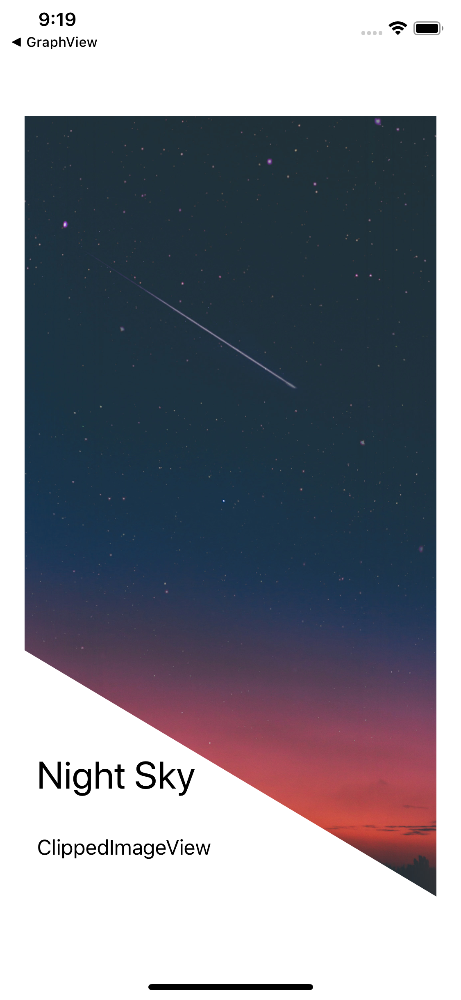

커스텀 이미지뷰
* UIImageView를 SubClassing 구현
* UIBeizerPath, CAShapeLayer, CGPath
* @IBDesignable, @IBInspectable


Screen Shot
---
iPhoneXS
Before and After

 


```
// StoryBoard에서 바로 확인 가능하도록 처리
@IBDesignable
class ClippedImageView: UIImageView {
    
    // StoryBoard의 Inspector Attribute 목록에 표시되도록 처리
    @IBInspectable var clipHeight: CGFloat = 0

    override func layoutSubviews() {
        
        // Masking할 영역
        let bezier: UIBezierPath = UIBezierPath()
        bezier.move(to: CGPoint.zero)
        bezier.addLine(to: CGPoint(x: self.bounds.width, y: 0))
        bezier.addLine(to: CGPoint(x: self.bounds.width, y: self.bounds.height))
        bezier.addLine(to: CGPoint(x: 0, y: self.bounds.height - self.clipHeight))
        bezier.close()
        
        // 영역을 Layer로 변환
        let imageFilter = CAShapeLayer()
        imageFilter.path = bezier.cgPath
        
        // Layer를 이용하여 ImageView Masking
        self.layer.mask = imageFilter
    }
}

```
