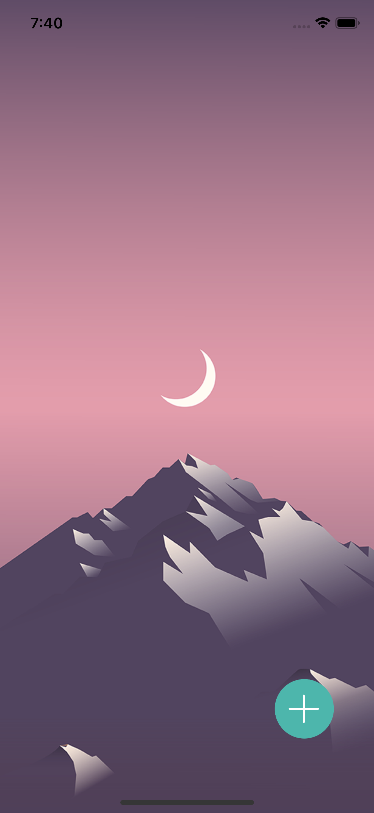
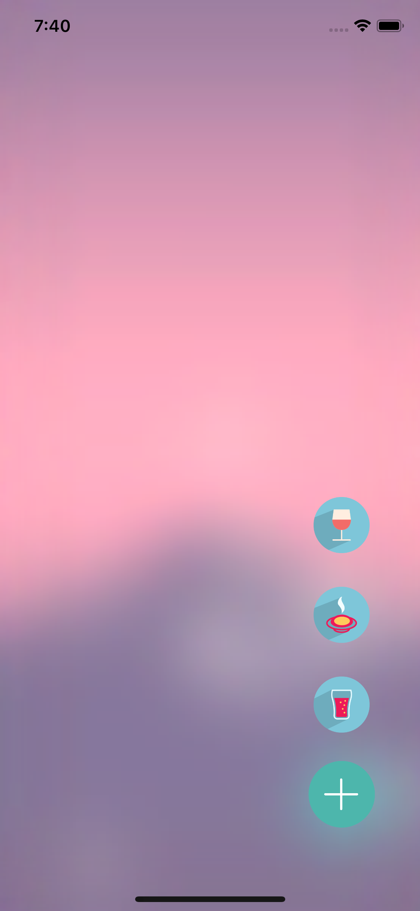

Floating Button 구현 
* constratint를 코드에서 변경 
* animation 사용
* visual effect view(blur) 사용
* modalPresentationStyle = .overCurrentContext 이용하여 다음 VC가 오버랩 되도록 표시 

Screen Shot
---
iPhoneXS
Before and After

 
