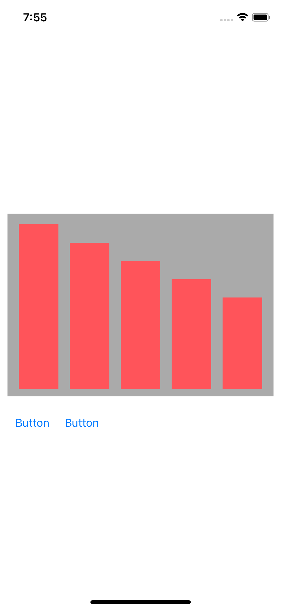
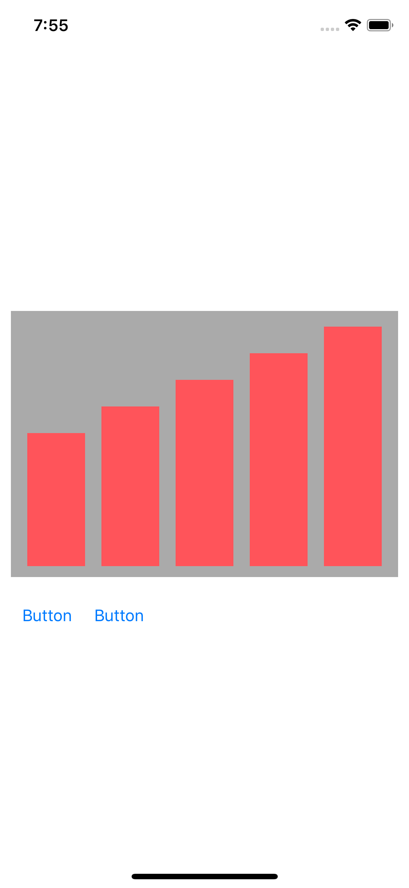

그래프 뷰 구현 
* constratint를 코드에서 변경 
* animation 사용
* extension 사용하여 code에서 multiplier를 동적으로 변경할 수 있도록 구현


Screen Shot
---
iPhoneXS
Before and After

 


```
extension NSLayoutConstraint {
    
    func changeMultiplier(value: CGFloat) -> NSLayoutConstraint {
        
        NSLayoutConstraint.deactivate([self])
        
        let newConstraint = NSLayoutConstraint(item: self.firstItem, attribute: self.firstAttribute, relatedBy: self.relation, toItem: self.secondItem, attribute: self.secondAttribute, multiplier: value, constant: self.constant)
        
        newConstraint.priority = self.priority
        newConstraint.shouldBeArchived = self.shouldBeArchived
        newConstraint.identifier = self.identifier
        
        NSLayoutConstraint.activate([newConstraint])
        
        return newConstraint
    }
}

```
