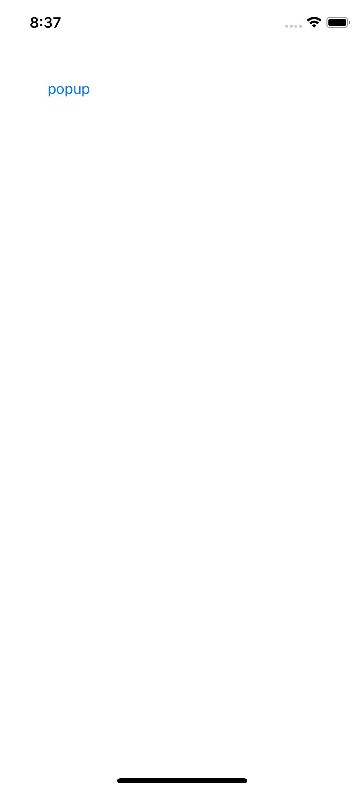
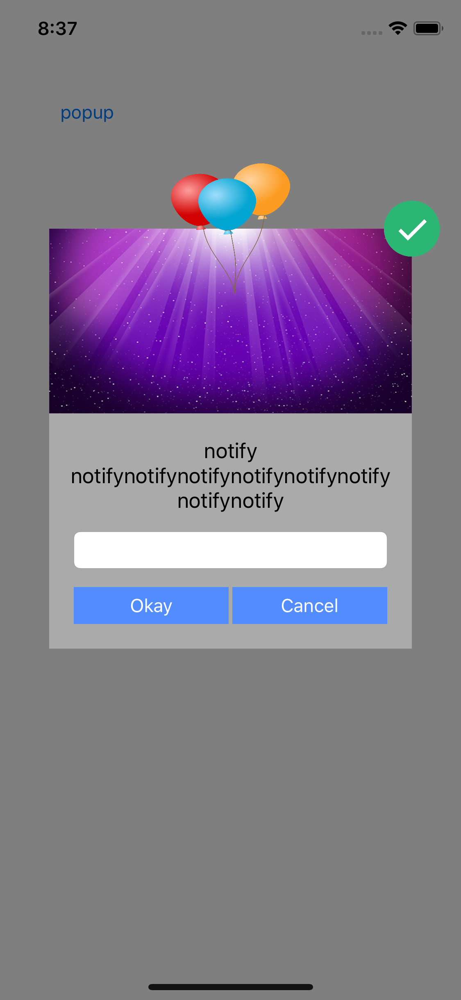

UIViewController를 이용한 Popup Window 구현
* window의 범위 밖에 있는 부분 표현, 버튼 동작
* 별도의 StoryBoard, UIViewController를 이용하여 main StoryBoard와 독립적인 파일로 구성

* 


Screen Shot
---
iPhoneXS

 


```
    @IBAction func popupWindow(_ sender: Any) {
        
        // StoryBaord 이름을 이용하여 객체 생성
        let popupStoryboard = UIStoryboard.init(name: "PopupWindow", bundle: nil)
        
        // StoryBoard 내에서 ViewController 이름으로 객체 생성
        let popupVC = popupStoryboard.instantiateViewController(withIdentifier: "popupWindow")
        
        // ViewController의 present style
        popupVC.modalPresentationStyle = .overCurrentContext
        
        self.present(popupVC, animated: false, completion: nil)
    }
```
